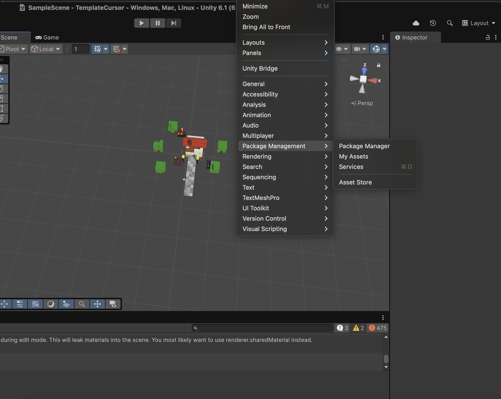
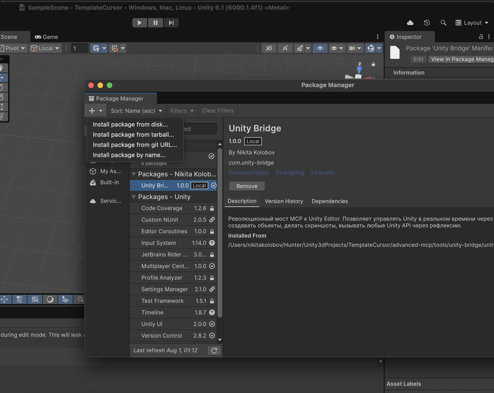

# 🚀 Unity MCP Template

**Революционная интеграция AI и Unity3D через Model Context Protocol**

[](https://unity.com/)
[](https://nodejs.org/)
[](https://modelcontextprotocol.io/)
[](LICENSE)

> 🎮 **Прямое управление Unity Editor через AI ассистентов**  
> 🤖 **Выполнение C# кода в реальном времени**  
> 📸 **Автоматические скриншоты и анализ сцены**  
> 🛠️ **Системная диагностика и мониторинг**

## 🌟 Возможности

### 🎯 Unity Bridge - Прямое управление Unity
- **🔧 C# Code Executor** - Выполнение произвольного C# кода в Unity Editor
- **📷 Smart Screenshots** - Game View скриншоты и кастомные ракурсы камеры
- **🏗️ Scene Analysis** - Анализ иерархии объектов и компонентов
- **🎮 Real-time Control** - Создание, изменение и удаление объектов

### 💻 Advanced Terminal Tools
- **🔍 System Monitor** - Мониторинг портов, процессов и системной информации
- **🌐 Network Diagnostics** - Проверка доступности сервисов
- **📊 Process Manager** - Поиск и управление процессами
- **🔄 Echo Testing** - Тестирование MCP подключения

### ⚡ Современная архитектура
- **🔥 Hot Reload** - Динамическая загрузка модулей без перезапуска
- **🛡️ Crash Protection** - Глобальная защита от падения сервера
- **📦 Modular Design** - Легко расширяемая модульная система
- **🚀 High Performance** - Оптимизированная функциональная архитектура

## 🎬 Демонстрация

### Unity Bridge в действии


*AI ассистент создает 3D объекты, управляет материалами и делает скриншоты в Unity*

### Поддерживаемые Unity операции

```csharp
// Создание объектов с физикой
var cube = GameObject.CreatePrimitive(PrimitiveType.Cube);
cube.AddComponent<Rigidbody>().mass = 1.5f;

// Работа с материалами  
var material = new Material(Shader.Find("Universal Render Pipeline/Lit"));
material.color = Color.red;
cube.GetComponent<Renderer>().material = material;

// LINQ анализ сцены
using System.Linq;
var allCubes = Object.FindObjectsOfType<Transform>()
    .Where(t => t.name.Contains("Cube"))
    .ToArray();
```

## 🔧 Быстрый старт

### Системные требования

- **Unity 2022.3+** (протестировано на Unity 6.1)
- **Node.js 18+** 
- **macOS** (основная платформа), **Windows** (может потребовать адаптации)

### 1️⃣ Установка MCP сервера

1. Клонируйте репозиторий:
```bash
git clone git@github.com:HuntNight/unity-mcp-advanced.git
cd unity-mcp-advanced
```

2. Установите зависимости:
```bash
cd advanced-mcp
npm install
```

### 2️⃣ Настройка Cursor

Создайте файл `.cursor/mcp.json` в корне проекта:

```json
{
  "mcpServers": {
    "enhanced-mcp": {
      "command": "node",
      "args": [
        "/path/to/your/project/advanced-mcp/index.js"
      ],
      "env": {
        "NODE_ENV": "production"
      }
    }
  }
}
```

> ⚠️ **Важно**: Замените `/path/to/your/project/` на абсолютный путь к вашему проекту

### 3️⃣ Установка Unity Extension

1. Откройте ваш Unity проект
2. Откройте **Window** → **Package Manager**
3. Нажмите **+** → **Install package from disk...**



4. Выберите папку `advanced-mcp/tools/unity-bridge/unity-extension`



5. Дождитесь завершения импорта пакета


### 4️⃣ Запуск Unity Bridge

1. В Unity Editor откройте **Window** → **Unity Bridge**
2. В открывшемся окне нажмите **Start Server**
3. Сервер запустится на порту 7777

✅ **Готово!** Теперь AI ассистент может управлять Unity через MCP

## 🛠️ Использование

### Базовые команды

```javascript
// Создание скриншота Unity
unity_screenshot()

// Выполнение C# кода  
unity_execute({
  code: `
    var cube = GameObject.CreatePrimitive(PrimitiveType.Cube);
    cube.name = "AI_Cube";
    return "Куб создан!";
  `
})

// Анализ сцены
unity_scene_hierarchy({ detailed: true })

// Системная диагностика
system_info()
check_port({ port: 7777 })
```

### Продвинутые примеры

#### 🎨 Создание материалов
```csharp
public class MaterialCreator {
    public Material CreateMaterial(Color color, float metallic) {
        var material = new Material(Shader.Find("Universal Render Pipeline/Lit"));
        material.color = color;
        material.SetFloat("_Metallic", metallic);
        return material;
    }
}

var creator = new MaterialCreator();
var redMetal = creator.CreateMaterial(Color.red, 0.8f);
```

#### 🔍 LINQ анализ
```csharp
using System.Linq;

var renderers = Object.FindObjectsOfType<Renderer>();
var materialGroups = renderers
    .GroupBy(r => r.material.name)
    .ToDictionary(g => g.Key, g => g.Count());
    
return $"Найдено материалов: {materialGroups.Count}";
```

## 🏗️ Архитектура

### MCP Server (Node.js)
```
advanced-mcp/
├── index.js              # Главный сервер с защитой от падений
├── tools/                # Динамически загружаемые модули
│   ├── unity.js          # Unity Bridge API
│   ├── terminal.js       # Системные инструменты  
│   └── unity-bridge/     # Unity расширение
└── utils/                # Общие утилиты
    ├── mcpServer.js      # Динамическая загрузка модулей
    ├── logger.js         # Система логирования
    └── processHelpers.js # Безопасные системные вызовы
```

### Unity Extension (C#)
```
Editor/
├── UnityBridge.cs        # Главный композитор
├── UnityOperations.cs    # Unity API операции
├── HttpServer.cs         # HTTP сервер (порт 7777)
├── Messages.cs           # Структуры данных
├── ResponseBuilder.cs    # Построитель ответов
├── ErrorCollector.cs     # Сборщик ошибок
└── JsonUtils.cs          # JSON утилиты
```

### Функциональная архитектура
- **🔧 Чистые функции** - без побочных эффектов
- **📦 Immutable структуры** - безопасная работа с данными  
- **🔄 Композиция** - модули соединяются в пайплайн
- **⚡ DRY принцип** - отсутствие дублирования кода

## 🌍 Платформы

### ✅ Полностью поддерживается
- **macOS** - основная платформа разработки и тестирования

### ⚠️ Ограниченная поддержка  
- **Windows** - может потребовать адаптация

> 💡 **Для пользователей Windows**: Если возникают проблемы, попросите AI ассистента:  
> *"Изучи проект, адаптируй все MCP инструменты под мою операционную систему"*

## 🔍 Диагностика

### Проверка подключения
1. **Тест MCP**: используйте команду `echo("test")` для проверки связи
2. **Unity сервер**: проверьте `check_port(7777)` 
3. **Системная информация**: `system_info()` покажет состояние системы

### Частые проблемы

| Проблема | Решение |
|----------|---------|
| Unity Bridge не отвечает | Перезапустите Unity Bridge Window |
| MCP сервер не загружается | Проверьте путь в `.cursor/mcp.json` |
| C# код не компилируется | Используйте полные namespace'ы (`UnityEngine.Object`) |
| Порт 7777 занят | Перезапустите Unity или найдите процесс `find_process("Unity")` |

## 🚀 Продвинутые возможности

### Hot Reload модулей
```javascript
// Модули загружаются динамически
// Изменили файл в tools/ → сохранили → работает!
```

### Защита от падений
```javascript
// Глобальная защита от uncaughtException и unhandledRejection
// Сервер никогда не упадет из-за ошибок в коде
```

### Автоматические скриншоты
```javascript
// Каждый инструмент может включить системный скриншот
terminal_echo({ message: "test", systemScreenshot: true })
```

### Unity API покрытие
- ✅ **GameObject, Transform, Renderer**
- ✅ **Material, Shader, Texture** 
- ✅ **Rigidbody, Collider, Physics**
- ✅ **Light, Camera, Scene Management**
- ✅ **LINQ, Collections, Math**
- ✅ **Editor API, AssetDatabase**

## 📊 Метрики производительности

| Операция | Время отклика |
|----------|---------------|
| C# код выполнение | 50-200ms |
| Game View скриншот | 100-500ms |
| Анализ сцены | 200-1000ms |
| Системная диагностика | 10-50ms |

### Оптимизации
- **🔄 Кеширование компиляций** - повторный код выполняется мгновенно
- **⚡ Функциональная архитектура** - без состояния и мутаций
- **🎯 Thread-safe операции** - безопасность главного потока Unity

## 🤝 Вклад в проект

Мы приветствуем любые улучшения! 

### Добавление нового MCP модуля

1. Создайте файл `advanced-mcp/tools/my-module.js`
2. Используйте стандартный формат экспорта:

```javascript
export const myTools = [
  {
    name: "my_tool",
    description: "Описание инструмента",
    inputSchema: {
      type: "object", 
      properties: {
        param: { type: "string", description: "Параметр" }
      },
      required: ["param"]
    },
    handler: async (args) => {
      const { param } = args;
      return `Результат: ${param}`;
    }
  }
];

export const myModule = {
  namespace: "my",
  description: "Описание модуля",
  tools: myTools
};
```

3. Перезапустите MCP сервер в Cursor
4. Готово! Модуль автоматически загрузится

## 📄 Лицензия

MIT License - смотрите [LICENSE](LICENSE) файл для деталей.


## 📞 Поддержка

- 🐛 **Баги**: [GitHub Issues](https://github.com/HuntNight/unity-mcp-advanced/issues)
- 💡 **Идеи**: [GitHub Discussions](https://github.com/HuntNight/unity-mcp-advanced/discussions)  
- 📧 **Email**: nik.kolobov@vk.com

---

<div align="center">

**🚀 Готовы управлять Unity силой мысли? Начните прямо сейчас!**

[⬆️ Наверх](#-unity-mcp-template) | [🔧 Установка](#-быстрый-старт) | [📖 Документация](#-использование)

</div>
